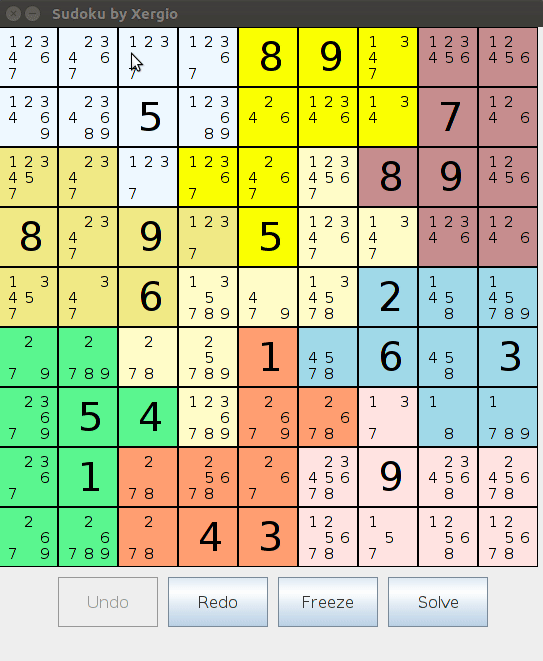

# Sudoku MVC Java Swing Implementation

This implementation solve a Sudoku Board using Backtracking.

## Usage with console

```
cd SudokuSrc
javac Watch.java
java Watch
```

## Usage with Netbeans

Just open `SudokuNetbeans` project with Netbeans IDE.

## Preview

